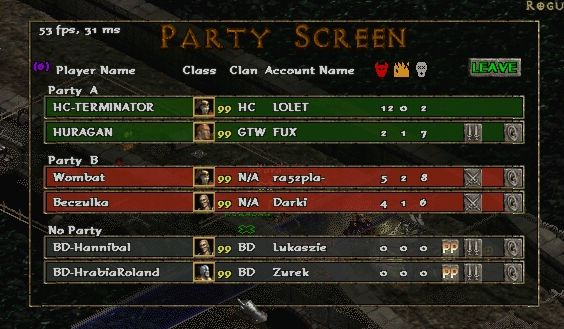
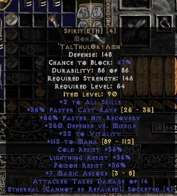
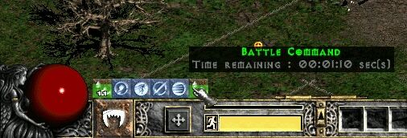
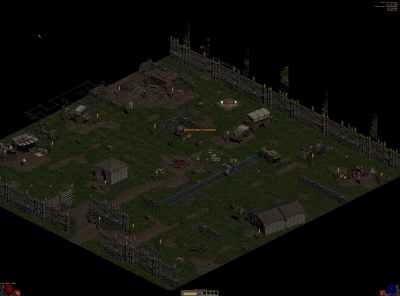

D2Ex2
=====

A Diablo II 1.11b/1.13d improvement mod. Been used on realm.angrenost.org.

Key features
--------
- Completely reworked party screen, can handle up to 64 players
- Fixed some vanilla bugs, random crashes etc
- Expanded Sounds.Txt limit to 4954, you can easily increase to more
- Reduced TCP/IP / Open BNet join time.
- Lagometer (ported from Q3 source :D)
- Reworked ESC-menu, get rid of .dc6 files. Now creating your own menu is easy as pie (ExOptions.cpp)
- Created a lot of custom controls, you can use them to create your GUI (ie new party screen)
- Supports both 1.11b & 1.13d (set version in stdafx.h (1.11b may have missing some pointers))
- ExBuffs module let see you states, auras and remaining time
- [WIP] High resolution support for GDI / GLIDE video modes.
- Packet sender / receiver (commands #send, #recv)
- Items stat range (press CTRL + hoover on an item)

Configuration
-------------
You can set build flags in stdAfx.h. However flags related to D2EX_PVPGN_EXT won't work for you unless you have serverside DLL which i won't make public.  
List of flags / values you can set:
* **D2EX_CLOSED_BNET**: make hack usable on closed bnet
* **D2EX_SCRAP_HACKS**: some random hacks like bugged wsg
* **D2EX_MULTIRES**: enables high resolution settings
	* **D2EX_OPENGL**: experimental, enables OpenGL render mode (ExOpenGL.cpp / ExTexture.cpp is not available in the repo, so it won't work for you)
	* **D2EX_ALLOWHIGHRES**: enables support for 800x600+  
	* **D2EX_MINIMALRES**: restrict resolution to 1024x768 and 1280x1024  
* **D2EX_PVPGN_EXT**: enables serverside stuff like kill counter, spectator mode etc. All the following subflags needs serverside changes to work.
	* **D2EX_PVPGN_GIVEUP**: adds Give up to ESC menu
	* **D2EX_ARGOLD**: enables client support for virutal gold service in trade window
	* **D2EX_FORUMGOLD**: enables client support to replace gold with external forum gold currency
	* **D2EX_SPECTATOR**: enables client support for spectator mode
		* **D2EX_SPECTATOR_STATE**: states.txt record set on spectators
	* **D2EX_COLOR_STAT**: itemStatCost.Txt record which stores item color value
	* **D2EX_LOOTED_STAT**: itemStatCost.Txt record which stores monster id which gave the item
	* **D2EX_CUSTOM_CUBE_RECIPES**: Adds "portal" keyword to CubeMain.Txt output
* **D2EX_EXAIM_ENABLED**: experimental -- never finished -- abandoned project of intelligent autoaim
* **D2EX_PVM_BUILD:** enables maphack with monsters on the map, autotele, etc.
* **D2EX_MAX_SND_TXT_ROWS**: maximum rows in Sound.txt
* **D2EX_I_NEED_CUBE**: define if you need transmute button, otherwise it will be used as auto-precast feature
* **D2EX_TP_RANGE**: maximum teleport range for AutoTele
* **D2EX_ENABLE_PACKET_COMMANDS**: enables packet commands in Release build
* **D2EX_DEBUG_INFO**: Show current mouse X&Y, and the selected unit id in Release build
* **D2EX_PRINT_ITEMLEVEL**: Print "Item Level" on an item description
* **D2EX_EXTENDED_LEVELS**: Extends Levels.txt limit to 255

Installation
-------------
1. Compile Release build (select configuration for your version) using Visual Studio 2012 or newer.
2. Copy everything from files directory to your Diablo II directory, D2Win.dll is a loader for D2Ex2.dll. If you use prebuilt D2Ex2.dll, then you'll need to install this: http://www.microsoft.com/en-us/download/details.aspx?id=40784
3. Warning: Files ExOpenGL.cpp and ExTexture.cpp/h are not included in this repo. You have to remove them manually from Solution Explorer to make build succeed.

Showcase
------------
* 22 vs 22 video (Early version) 

* Party screen with kill/assist/death counter 

* Stat range (CTRL + hover on an item) 

* Buffs 

* Can you guess what resolution it is? 

Thanks to
----------
Vav for motivation  
MrMag-WS for testing platform  
RoluS/Zurek/InteR for some great ideas  
Phrozen Keep forums for great source of informations  
